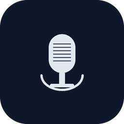

<p align="center">
  
</p>

<h1 align="center">Caddie</h1>

<p align="center">
  <strong>Your meetings, your Mac, your data.</strong><br>
  A native macOS menu bar app that automatically records, transcribes, and indexes your meetings — entirely on-device.
</p>

<p align="center">
  
  
  
  
  
  
</p>

---

## What It Does

Caddie lives in your menu bar and watches for meetings. When one starts, it records. When it ends, it transcribes. Everything stays on your Mac.

| | |
|---|---|
| | |
|---|---|
| **Detect** | Auto-detects Zoom, Teams, Meet, Slack, Discord, Webex, FaceTime — or via Google Calendar |
| **Record** | Stereo capture — system audio + microphone, with configurable input device |
| **Transcribe** | On-device ASR with speaker diarization via Apple Neural Engine |
| **Store** | Searchable local database with full-text search across all transcripts |
| **Calendar** | Google Calendar integration — sign in via OAuth2, auto-detect remote meetings |
| **Manual** | Start/stop recording anytime from the menu bar |
| **Notify** | macOS notifications on recording start, transcription complete, and errors |

**Privacy-first.** All processing on-device. Network only for Google Calendar sync (optional) and Sparkle updates.

## How It Works

```
Meeting detected ──> Record (stereo WAV) ──> Transcribe (Parakeet ASR)
                                          ──> Diarize (Sortformer)
                                          ──> Merge + Store (SQLite/FTS5)
                                          ──> Compress (ALAC)
                                          ──> Notify
```

Caddie monitors active audio sessions via CoreAudio, window titles via Accessibility, and your Google Calendar via OAuth2. When a meeting is detected — locally or from your calendar — it prompts you to start recording, then captures two audio streams: system audio (other participants) and your microphone. Today's schedule appears in the sidebar so you always know what's coming up. You can also start/stop recording manually from the menu bar.

Google sign-in is required during onboarding and to unlock calendar features (today's schedule, calendar-based meeting prompts). Local recording, playback, and your recordings library remain fully usable even when signed out — the sidebar simply surfaces a compact sign-in card where the schedule would appear.

After the meeting ends, a local ML pipeline runs Parakeet ASR and Sortformer speaker diarization on CoreML, accelerated by the Apple Neural Engine. The transcript with speaker labels is stored alongside ALAC-compressed audio in a GRDB-backed SQLite database, fully indexed for search.

## Architecture

Built on a hardened, production-solid foundation:

- **RecordingCoordinator** — Actor-based state machine managing the full lifecycle (`idle -> recording -> transcribing -> done/error`)
- **Lock-free audio** — SPSC ring buffers on the real-time CoreAudio thread (no locks, no priority inversion)
- **Protocol-based DI** — ML engines abstracted behind protocols for testability without hardware
- **160+ tests** — covering state transitions, pipeline error paths, data integrity, auth flows, and ring buffer behavior
- **Every error handled** — zero `try?`, zero force unwraps, all closures guarded

## Requirements

- **macOS 14.2** (Sonoma) or later
- **Apple Silicon** recommended (M1+) for Neural Engine acceleration
- Intel Macs supported but transcription will be slower

## Installation

### Download

Grab the latest `.dmg` from [Releases](../../releases), mount it, and drag Caddie to your Applications folder.

> **First launch:** Caddie is signed and notarized with Apple. Just drag to Applications and open.
> Then open Caddie normally from Launchpad or Applications.

### Build from Source

```bash
brew install xcodegen create-dmg
xcodegen generate
open Caddie.xcodeproj
```

Build and run with **Cmd+R** in Xcode. Or build a DMG:

```bash
make dmg
```

### Google Calendar Setup (Optional)

To enable Google Calendar integration:

1. Create a project in [Google Cloud Console](https://console.cloud.google.com)
2. Enable the **Google Calendar API**
3. Configure **OAuth consent screen** (External, Testing mode, add your email as test user)
4. Create an **OAuth 2.0 Client ID** (Desktop application type)
5. Copy `Sources/Calendar/GoogleOAuthSecrets.swift.template` to `Sources/Calendar/GoogleOAuthSecrets.swift` and fill in your client ID and secret from Google Cloud Console (the real file is gitignored and never committed)
6. Update the reversed client ID in `Resources/Info.plist` to match your client ID
7. Run `xcodegen generate` to regenerate the project

## Permissions

| Permission | Why |
|---|---|
| **Microphone** | Record your voice during meetings |
| **Screen Recording** | Capture system audio from meeting apps |
| **Accessibility** | Detect active meeting windows |
| **Google Calendar** | Display today's events and detect meetings (via OAuth2, no Apple Calendar needed) |
| **Notifications** | Alert you when recordings start/stop and transcriptions complete |

All requested through standard macOS prompts. Revoke anytime in System Settings > Privacy & Security.

## Privacy

- All audio and transcripts stored locally on your Mac
- Google Calendar sync is optional — only reads event metadata (titles, times), never uploads audio or transcripts
- No analytics, telemetry, or crash reporting
- ML models bundled in the app — no runtime downloads
- Recordings are yours — export, move, or delete anytime

## Tech Stack

| Layer | Technology |
|-------|-----------|
| **Language** | Swift 6.0, strict concurrency |
| **UI** | SwiftUI, AppKit (menu bar) |
| **Audio** | CoreAudio, AVFoundation, lock-free SPSC ring buffers |
| **ML** | FluidAudio (Parakeet ASR + Sortformer diarization on CoreML/ANE) |
| **Database** | GRDB 7.10 (SQLite with FTS5 full-text search) |
| **Detection** | CoreAudio process monitoring, AXSwift (Accessibility), Google Calendar API v3 |
| **Auth** | OAuth2 PKCE (browser-based), macOS Keychain |
| **Updates** | Sparkle |
| **Build** | XcodeGen, Swift Package Manager |

## Roadmap

### Recently Shipped (v2.0)

- Google Calendar integration — today's events in sidebar, meeting detection prompts
- Google OAuth2 sign-in with PKCE (browser-based, tokens in Keychain)
- No Apple Calendar dependency — events fetched directly from Google Calendar API
- Audio device picker (select Loopback/Jump Desktop as capture source)
- HAL AudioUnit rewrite for microphone capture
- Manual start/stop recording from menu bar
- Google Account section in Settings (sign-in/sign-out)
- Apple notarized DMG distribution

### Foundation (v1.0)

- Lock-free audio capture (SPSC ring buffers, no priority inversion)
- Actor-based recording coordinator with explicit state machine
- Protocol-based DI for ML engines (testable without hardware)
- Pipeline data integrity (no silent transcript loss, safe file lifecycle)
- Systematic error discipline (zero `try?`, zero force unwraps, all closures guarded)
- Precondition guards (disk space check, model download timeout)
- User feedback (recording mode in menu bar, transcription progress, macOS notifications)
- Device disconnection resilience (graceful stop, stale aggregate cleanup)

### Up Next

- **Calendar-based detection** — auto-start recording when Google Calendar meetings begin
- **Pre-meeting notification** — "Recording starts in 2 min" prompt before scheduled meetings
- **Calendar metadata** — show event title and attendees in meeting list
- **AI summaries** — action items, key decisions, and highlights extracted from transcripts

## License

MIT
